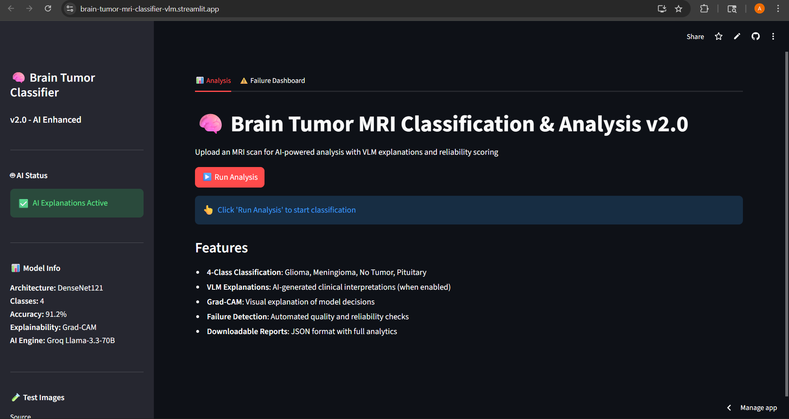
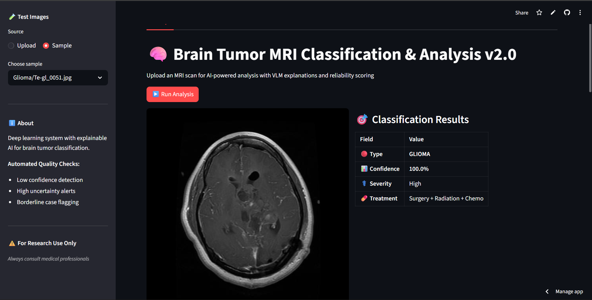
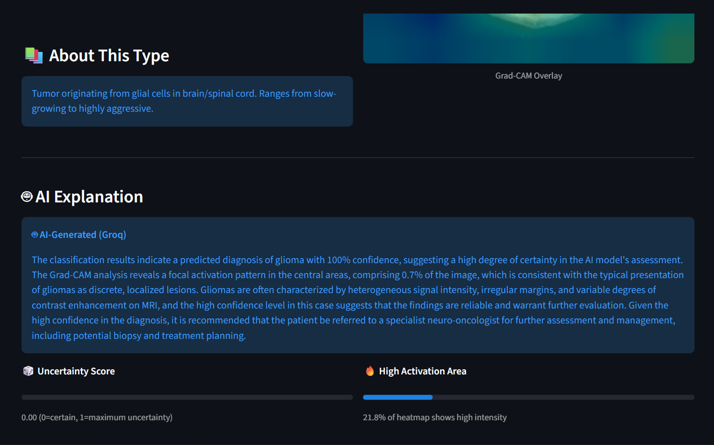

# 🧠 Brain Tumor Classifier v2.0

**AI-Powered Brain Tumor MRI Classification with Explainable AI**

[](https://www.python.org/downloads/)
[](https://streamlit.io)
[](LICENSE)
[](https://groq.com)

**Live App:** https://brain-tumor-mri-classifier-vlm.streamlit.app/

> Advanced deep learning system for brain tumor classification using DenseNet121, Grad-CAM visualization, and AI-powered clinical explanations.



---

## 🖼️ Screenshots

**Home**


**Sample Picker**


**Results**


---

## 📄 Sample Report

- [Example PDF report](reports/brain_tumor_report_glioma_20260402_175155.pdf)

---

## ✨ Features

### 🤖 **AI-Powered Analysis**
- **Groq Llama-3.3-70B** integration for professional medical explanations
- Automated clinical recommendations based on classification results
- Context-aware explanations that adapt to confidence levels

### 🔬 **Explainable AI (XAI)**
- **Grad-CAM heatmaps** show exactly where the model focuses
- Visual overlay on original MRI scans
- Quantitative activation analysis (focal/moderate/diffuse patterns)

### ⚠️ **Intelligent Quality Control**
- **3-Mode Failure Detection System:**
  - **Low Confidence:** Flags predictions below reliability threshold
  - **High Entropy:** Detects uncertain classifications
  - **Borderline Cases:** Identifies when top predictions are too close
- Automated reliability scoring with uncertainty metrics

### 📊 **Comprehensive Reporting**
- **PDF Reports** with embedded images and detailed analysis
- **JSON Exports** for integration with other systems
- **Grad-CAM Downloads** for presentations and documentation

### 📈 **Analytics Dashboard**
- Real-time failure case tracking
- Class distribution breakdown
- Temporal analysis of quality metrics
- Exportable failure logs

---

## 🎯 Tumor Classification

The system classifies brain MRI scans into **4 categories**:

| Class | Description | Typical Features |
|-------|-------------|------------------|
| **Glioma** | Malignant glial cell tumor | Irregular margins, mass effect, edema |
| **Meningioma** | Benign meningeal tumor | Well-defined, dural attachment |
| **Pituitary** | Pituitary gland tumor | Sellar/suprasellar location |
| **No Tumor** | Healthy brain tissue | Normal anatomy, no mass lesions |

**Model Performance:** 91.2% accuracy on validation set

---

## 🚀 Quick Start

### Prerequisites
- Python 3.8 or higher
- Groq API Key (free at [console.groq.com](https://console.groq.com))

### Installation

1. **Clone the repository**
   ```bash
   git clone https://github.com/ashutosh8021/Brain-Tumor-MRI-Classifier-VLM.git
   cd Brain-Tumor-MRI-Classifier-VLM
   ```

2. **Install dependencies**
   ```bash
   pip install -r requirements.txt
   ```

3. **Set up environment variables**
   ```bash
   # Copy the example file
   cp .env.example .env
   
   # Edit .env and add your Groq API key
   # GROQ_API_KEY=gsk_your_actual_key_here
   ```

4. **Run the application**
   ```bash
   streamlit run app.py
   ```

5. **Open your browser**
   - Navigate to `http://localhost:8501`
   - Upload an MRI scan and get instant analysis!

---

## 📖 Usage

### 1️⃣ Upload MRI Scan
- Drag & drop or browse for JPEG/PNG files
- System accepts standard brain MRI images

### 2️⃣ View Classification
- **Prediction** with confidence percentage
- **Risk severity** and treatment approach
- **Probability distribution** across all classes

### 3️⃣ Analyze Grad-CAM
- **Heatmap overlay** shows AI focus regions
- **Activation metrics** (focal/moderate/diffuse)
- **Brain region localization** (superior/inferior/hemispheric)

### 4️⃣ Get AI Explanation
- **Clinical interpretation** from Groq AI
- **Imaging features** associated with the diagnosis
- **Recommendations** for next steps (specialist referral, follow-up, etc.)

### 5️⃣ Review Quality Metrics
- **Uncertainty score** (Shannon entropy)
- **Reliability assessment** (pass/fail)
- **Failure alerts** if quality checks fail

### 6️⃣ Download Reports
- **PDF Report** - Professional 2-page document
- **JSON Report** - Structured data for integration
- **Grad-CAM Image** - High-resolution heatmap

### 7️⃣ Monitor Failures (Dashboard Tab)
- View all flagged cases
- Analyze failure patterns
- Export logs for review

---

## 🛠️ Technical Architecture

### Model
- **Architecture:** DenseNet121 (pretrained on ImageNet, fine-tuned)
- **Input:** 224×224 RGB MRI scans
- **Output:** 4-class softmax probabilities
- **Explainability Layer:** `conv5_block16_concat`

### AI Explanation Engine
- **Provider:** Groq Cloud API
- **Model:** Llama-3.3-70B-Versatile
- **Approach:** Grad-CAM feature extraction → Text description → LLM analysis
- **Fallback:** Template-based explanations (works without API key)

### Quality Detection
- **Confidence Check:** Flags predictions < 50%
- **Entropy Check:** Shannon entropy normalized to [0,1], threshold 0.65
- **Margin Check:** Top-2 probability difference < 20%

### Report Generation
- **PDF:** ReportLab library, 2-page professional layout
- **JSON:** v2.0 schema with scan info, explainability, reliability metrics
- **Images:** PNG format, embedded base64 in JSON

---

## 📁 Project Structure

```
Brain-Tumor-MRI-Classifier-VLM/
├── app.py                          # Main Streamlit application (964 lines)
├── densenet121_brain_tumor_best.h5 # Trained model weights (51 MB)
├── requirements.txt                # Python dependencies
├── .env.example                    # Environment variable template
├── README.md                       # This file
├── CHANGELOG_v2.0.md              # Version 2.0 release notes
├── QUICK_REFERENCE.md             # User quick-start guide
├── LICENSE                         # MIT License
├── reports/                         # Sample PDF reports
├── screenshots/                    # Demo images and screenshots
├── sample_images/                  # Sample MRI scans for testing
└── .streamlit/
    └── secrets.toml               # Streamlit Cloud secrets template
```

---

## 🌐 Deployment

### Local Deployment
Follow the **Quick Start** guide above.

### Streamlit Cloud Deployment

1. **Push to GitHub** (already done!)
2. **Go to [share.streamlit.io](https://share.streamlit.io)**
3. **Deploy app:**
   - Repository: `ashutosh8021/Brain-Tumor-MRI-Classifier-VLM`
   - Branch: `main`
   - Main file: `app.py`
4. **Add secrets:**
   - Go to App Settings → Secrets
   - Add: `GROQ_API_KEY = "gsk_your_key_here"`
5. **Deploy!** ✨

---

## 🔑 Environment Variables

| Variable | Required | Description | How to Get |
|----------|----------|-------------|------------|
| `GROQ_API_KEY` | Optional* | Groq API key for AI explanations | [console.groq.com/keys](https://console.groq.com/keys) |

*App works without API key but uses template explanations instead of AI-generated ones.

---

## 📊 Report Structure

### JSON Report v2.0
```json
{
  "report_version": "2.0",
  "timestamp": "2026-04-01T12:00:00Z",
  "scan_info": {
    "predicted_class": "glioma",
    "confidence_pct": 98.5,
    "all_class_probabilities_pct": {...},
    "top2_margin_pct": 96.2
  },
  "explainability": {
    "gradcam_high_activation_pct": 12.3,
    "explanation_source": "vlm_groq_text",
    "explanation_source_label": "Groq AI (Llama-3.3-70B)",
    "ai_explanation": "..."
  },
  "reliability": {
    "uncertainty_score": 0.15,
    "uncertainty_label": "Low",
    "is_failure_case": false,
    "reliability_passed": true
  },
  "model_info": {
    "architecture": "DenseNet121",
    "accuracy": "91.2%"
  }
}
```

### PDF Report
- **Page 1:** Metadata, classification results, probability chart
- **Page 2:** MRI + Grad-CAM images, AI explanation, metrics, disclaimer

---

## ⚠️ Medical Disclaimer

**This system is for educational and research purposes only.**

- ❌ NOT approved for clinical diagnosis
- ❌ NOT a substitute for professional medical advice
- ❌ NOT validated for treatment decisions

**Always consult qualified healthcare professionals** for medical diagnosis and treatment.

---

## 🤝 Contributing

Contributions are welcome! Areas for improvement:

- 🧪 **Model Enhancement:** Train on larger datasets, try other architectures
- 🌍 **Multi-Language:** Add support for non-English medical reports
- 📱 **Mobile UI:** Responsive design for tablets/phones
- 🔬 **Additional Modalities:** Support CT, PET, FMRI scans
- 📊 **Advanced Analytics:** Time-series tracking, cohort analysis

### How to Contribute
1. Fork the repository
2. Create a feature branch (`git checkout -b feature/amazing-feature`)
3. Commit changes (`git commit -m 'Add amazing feature'`)
4. Push to branch (`git push origin feature/amazing-feature`)
5. Open a Pull Request

---

## 📜 License

This project is licensed under the MIT License - see the [LICENSE](LICENSE) file for details.

---

## 🙏 Acknowledgments

- **Model Architecture:** DenseNet121 ([Huang et al., 2017](https://arxiv.org/abs/1608.06993))
- **Grad-CAM:** [Selvaraju et al., 2017](https://arxiv.org/abs/1610.02391)
- **AI Engine:** [Groq Cloud](https://groq.com) - Llama-3.3-70B
- **Framework:** [Streamlit](https://streamlit.io)
- **Dataset:** Brain MRI Images for Tumor Detection

---

## 📞 Contact

**Ashutosh** - [@ashutosh8021](https://github.com/ashutosh8021)

**Project Link:** [https://github.com/ashutosh8021/Brain-Tumor-MRI-Classifier-VLM](https://github.com/ashutosh8021/Brain-Tumor-MRI-Classifier-VLM)

---

## 🌟 Star History

If this project helped you, please consider giving it a ⭐!

[](https://star-history.com/#ashutosh8021/Brain-Tumor-MRI-Classifier-VLM&Date)

---

<div align="center">

**Made with ❤️ for advancing medical AI**

🧠 Brain Tumor Classifier v2.0 | 2026

</div>
